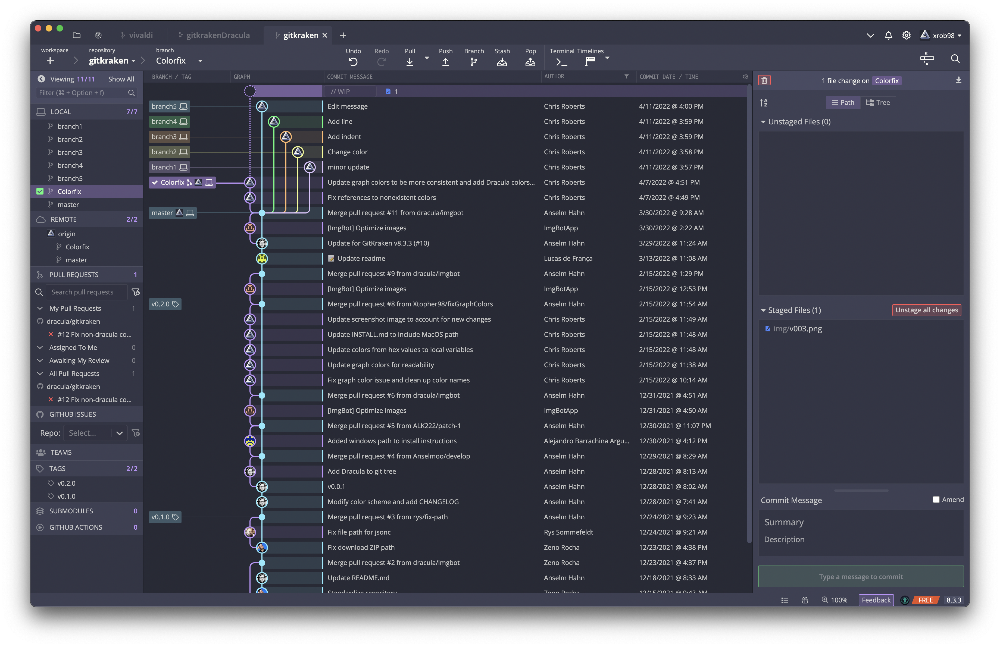
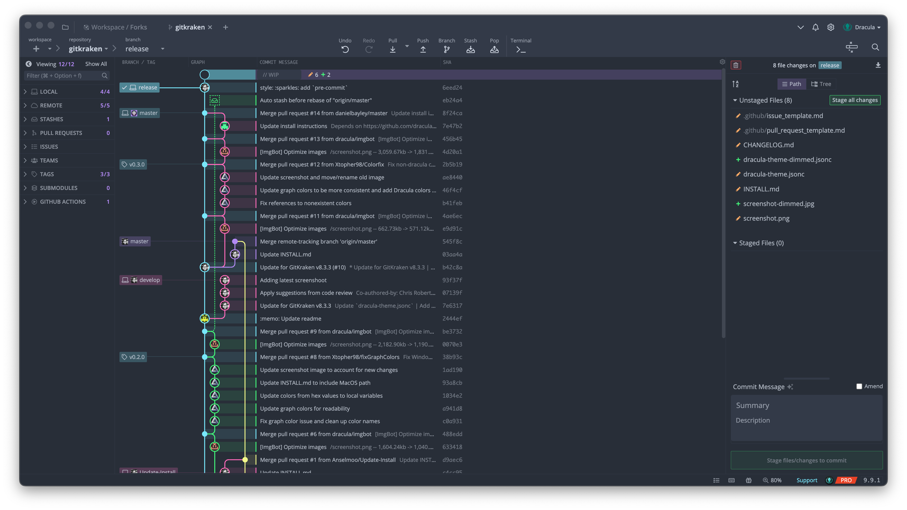

# Dracula for [GitKraken](https://www.gitkraken.com)

> A dark theme for [GitKraken](https://www.gitkraken.com).

## Modes

This theme comes in two variants, `Dracula` and `Dracula Dimmed`.

### Dracula

### Dracula Dimmed

## Install

All instructions can be found at [draculatheme.com/gitkraken](https://draculatheme.com/gitkraken).

## Team

This theme is maintained by the following person(s) and a bunch of [awesome contributors](https://github.com/dracula/gitkraken/graphs/contributors).

|  |
| --------------------------------------------------------------------------------------- |
| [Anselm Hahn](https://github.com/anselmoo)                                              |

## Community

- [Twitter](https://twitter.com/draculatheme) - Best for getting updates about themes and new stuff.
- [GitHub](https://github.com/dracula/dracula-theme/discussions) - Best for asking questions and discussing issues.
- [Discord](https://draculatheme.com/discord-invite) - Best for hanging out with the community.

## License

[MIT License](./LICENSE)
